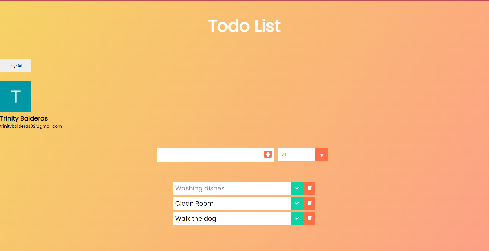

# Todo List

Keep track of tasks, showing a todo title, you'll be able to check off or delete each tasks as they been completed


## Tech Stack

Client: React, useState, useEffect, auth0

Server: Spring Boot, H2
## Features

- Register for an account
- Login/out
- Create tasks
- Check off tasks
- Delete tasks
## API Reference

#### Get all tasks

```http
  GET /api/tasks
```

#### Get task

```http
  GET /api/tasks/${id}
```

| Parameter | Type     | Description                       |
| :-------- | :------- | :-------------------------------- |
| `id`      | `long`   | **Required**. Id of task to fetch |

#### Create task

```http
  POST /api/tasks
```

| Parameter | Type     | Description                       |
| :-------- | :------- | :-------------------------------- |
| `body`    | `Task`   | **Required**. Task data to create |

#### Replace task

```http
  PUT /api/tasks/${id}
```

| Parameter | Type     | Description                       |
| :-------- | :------- | :-------------------------------- |
| `id`      | `long`   | **Required**. Id of task to fetch |
| `body`    | `Task`   | **Required**. Task data to replace|


#### Updated task

```http
  PATCH /api/tasks/${id}
```

| Parameter | Type     | Description                       |
| :-------- | :------- | :-------------------------------- |
| `id`      | `long`   | **Required**. Id of task to fetch |
| `body`    | `Task`   | **Required**. Task data to replace|

#### Delete task

```http
  DELETE /api/tasks/${id}
```

| Parameter | Type     | Description                       |
| :-------- | :------- | :-------------------------------- |
| `id`      | `long`   | **Required**. Id of task to delete|

#### Task Body

| Field     | Type     | Description                       |
| :-------- | :------- | :-------------------------------- |
| `title`   | `string` | Title of the task                 |
|`completed`| `boolean`| If task completed. default = false|


## Screenshots




## Demo

https://youtu.be/s7kFw0mi9E0

